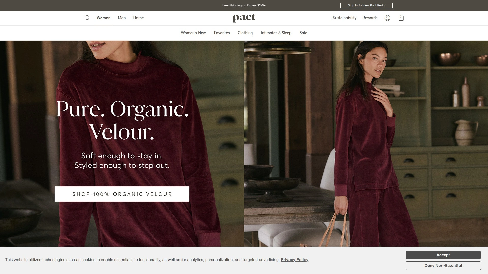

# 2025年十一大最佳奢华睡衣品牌

选购高品质睡衣时,面料舒适度、剪裁设计和耐洗程度是决定睡眠质量的三大关键要素。廉价睡衣往往在几次洗涤后起球变形,而专业睡衣品牌通过精选皮马棉、真丝和竹纤维等天然材质,配合精密剪裁工艺,让用户享受持久如新的舒适体验。从日常家居到度假旅行,选择合适的睡衣品牌直接影响穿着舒适度、使用寿命和整体生活品质。本文汇总11家经过市场验证的优质睡衣制造商,涵盖从经典条纹套装到奢华真丝loungewear的多元化需求,帮助您快速找到最适配自身睡眠习惯的高端睡衣解决方案。

***

## **[LAKE Pajamas](https://lakepajamas.com)**

想象中最柔软的睡衣,Vogue和Harper's Bazaar力荐

LAKE专注打造"想象中最柔软的睡衣",以皮马棉和府绸经典款闻名,为女性、男性和儿童提供全家庭睡衣解决方案。品牌理念是庆祝日常生活的乐趣,在最柔软的睡衣中培育甜美梦境,相信休息时间神圣、舒适至关重要、优质睡衣促进更好睡眠。

**媒体认可与品牌定位**:Vogue评价LAKE为"在家舒适的最佳睡衣",Harper's Bazaar形容其为"你想象中自己在南希·迈耶斯电影级海滨别墅穿的睡衣",Glamour赞誉"想象滑入你拥有的最舒适的东西,极乐"。这些顶级时尚媒体的背书确立LAKE在奢华睡衣市场的标杆地位。

LAKE的产品线包括畅销经典款和新宠系列,每件单品都是用户每晚(甚至白天)都会伸手拿的衣物。品牌提供具有竞争力的合作计划,合作伙伴可第一时间了解产品发布和促销信息,并获得专属LAKE团队成员支持,还包括赠品、惊喜和福利。

节日精选系列"The Good Stuff"涵盖节日清晨、安静傍晚和中间的一切时刻,展示品牌对生活仪式感的重视。LAKE特别适合追求品质生活的中产家庭、重视睡眠体验的专业人士、以及喜欢经典条纹设计的时尚爱好者。时尚博主评论"这是时尚睡衣套装的首选之地,物超所值"。

***

## **[Dagsmejan](https://dagsmejan.com)**

科学验证睡眠科技,瑞士温控面料专利

Dagsmejan是科学验证的睡眠科技睡衣品牌,专注帮助用户睡得更深更久。品牌理念是"通过更好睡眠过更好生活",解决许多人的睡眠问题或未能达到最佳睡眠状态的困境。

**科学技术支撑**:Dagsmejan睡衣经科学证明能帮助用户睡得更深更久,不仅提供极致睡眠舒适,更带来恢复性睡眠,让用户醒来时专注清晰、精力充沛迎接新一天。品牌提供最新睡眠研究成果以及睡眠如何影响健康、幸福感、表现和运动的权威内容。

合作计划提供高达8%回馈率,平均订单金额200瑞士法郎。所有合作伙伴享有个人试用折扣,获取全面营销素材和内容支持,以及Dagsmejan团队的个人化协助。申请流程简化为提交免费申请、等待审核、获取仪表板访问权限和个人试用折扣码、开始分享恢复性睡眠的益处。

Dagsmejan特别适合注重睡眠质量的健康意识人群、容易夜间出汗或体温调节困难的用户、以及重视科技面料和专利技术的理性消费者。瑞士制造背景和温控专利技术是核心竞争力。

***

## **[Cloud Nine Pajamas](https://www.cloudninepajamas.com)**

加拿大女性创立,超软竹纤维睡衣专家

Cloud Nine Pajamas是女性拥有的加拿大品牌,专注超软竹纤维睡衣、舒适loungewear和奢华分层单品,设计理念是让穿着者感受如云端般的舒适。品牌热情在于舒适,致力于创建真实的合作伙伴社区,这些伙伴对品牌有承诺并真心喜爱。

**合作生态系统**:Cloud Nine寻找创作者和品牌大使,提供多元化合作机会包括赠品、折扣码、内容创作、活动和更多附加机会。竹纤维面料的天然优势包括透气性、抗菌性、吸湿排汗能力,特别适合敏感肌肤和追求可持续时尚的消费者。

订单满$150即享免费配送,品牌强调加拿大本土制造的质量保证。产品线涵盖睡衣套装、loungewear单品和分层配件,满足从卧室到客厅的全场景穿着需求。

Cloud Nine特别适合环保意识强的消费者、寻找天然纤维替代品的敏感肌肤人群、以及支持女性创业和本土品牌的加拿大市场买家。竹纤维的可持续性和超软触感是核心卖点。

***

## **[Hill House Home](https://www.hillhousehome.com)**

Nap Dress病毒爆款,设计为中心的生活美学

Hill House Home以标志性Nap Dress系列风靡全球,是融合设计美学、无可挑剔品质和永恒精致风格的生活方式品牌。品牌通过优质产品增强和庆祝生活,将睡衣提升为可外穿的时尚单品。

**合作计划优势**:Hill House提供具竞争力的回馈率,30天追踪窗口确保长期转化归因。独家时事通讯提供特别内容、机会和产品发布信息,合作伙伴可调整用于自身营销。由El Toro Interactive管理的获奖团队专注于合作伙伴成功。

注册流程包括通过链接注册、添加品牌横幅和购物链接到网站或博客、通过时事通讯保持Hill House最新动态。ShopMy计划提供额外便利,允许创作者轻松创建单品链接并获得定制折扣码。

Nap Dress系列在社交媒体掀起病毒式传播,成为"可外穿睡衣"趋势的引领者。Hill House特别适合追求Instagram美学的千禧一代、需要多场景穿着灵活性的居家办公者、以及欣赏复古女性化设计的时尚爱好者。

***

## **[SKIMS](https://skims.com)**

Kim Kardashian塑形loungewear,邀请制高回馈

SKIMS是Kim Kardashian创立的下一代塑形衣、loungewear和内衣品牌,2019年发布当天售出价值200万美元库存,迅速成长为十亿美元公司。品牌专注创造适合所有体型和肤色的包容性塑形衣和loungewear。

**邀请制合作计划**:SKIMS合作计划目前采用邀请制,回馈率高达20%,30天追踪窗口。这一慷慨回馈策略从营销角度看非常聪明,激励大量创作者和影响者积极推广。品牌重点关注社交媒体影响者而非传统渠道。

SKIMS的成功很大程度归功于Kim Kardashian的名人效应以及通过模特、Instagram用户、名人和注册影响者的强大营销。Soft Lounge Rib Sleep Set等病毒爆款将舒适性与酷感融合,成为必备单品。

SKIMS特别适合拥有时尚和生活方式受众的影响者、追求塑形效果和loungewear多功能性的消费者、以及Kim Kardashian粉丝和潮流追随者。邀请制门槛提升品牌专属感,但对小型创作者可能构成挑战。

***

## **[Cozy Earth](https://cozyearth.com)**

竹纤维奢华睡衣,Oprah精选推荐

Cozy Earth专注高端竹纤维睡衣和家居用品,以奢华舒适和温度调节功能闻名。品牌承诺提供地球上最舒适的竹纤维产品,帮助用户睡得更好、生活更健康。

**合作网络优势**:Cozy Earth通过多个网络管理合作关系,为推广者提供灵活选择。竹纤维面料的天然优势包括透气性、抗菌性、温度调节和柔软触感,适合全年四季穿着。品牌在可持续时尚领域占据重要位置,吸引环保意识消费者。

产品线涵盖竹纤维睡衣套装、床上用品、loungewear和家居配件,打造完整的舒适生活生态系统。Oprah的"Favorite Things"清单曾精选Cozy Earth产品,提升品牌权威性和市场认知度。

Cozy Earth特别适合追求奢华体验的中高端消费者、注重可持续材料的环保人士、以及容易夜间出汗或体温调节困难的用户。竹纤维的天然温控能力和奢华触感是核心差异化优势。

***

## **[Lusomé](https://lusome.com)**

专利凉感面料,夜间盗汗解决方案

Lusomé专注解决夜间盗汗和潮热问题,睡衣采用专利凉感技术,帮助用户整夜保持凉爽舒适。品牌定位于功能性睡衣市场,为更年期女性和体温调节困难人群提供专业解决方案。

**功能性设计特点**:Lusomé的专利面料技术能主动吸湿排汗,快速蒸发多余水分保持皮肤干爽。这种科技面料与传统睡衣的被动透气不同,而是主动管理体温和湿度。产品设计考虑功能性同时不牺牲美观,提供时尚剪裁和多种颜色选择。

合作计划欢迎健康、保健和女性生活方式领域的内容创作者加入。目标受众明确且具有强烈痛点,转化率通常高于通用睡衣品牌。Lusomé提供营销素材和产品教育资源,帮助合作伙伴准确传达技术优势。

Lusomé特别适合经历更年期的中年女性、夜间盗汗困扰的用户、以及重视功能性超过纯装饰性的理性消费者。专利凉感技术和明确的问题解决定位是市场竞争力所在。

***

## **[Quince](https://www.quince.com)**

奢侈品质平民价格,直连制造商模式

Quince是高端生活方式品牌,通过消除中间商直接与世界级制造商合作,以传统零售价的几分之一提供奢华产品。产品线包括羊绒毛衣、意大利皮革包、真丝loungewear和精美珠宝。

**商业模式创新**:Quince的直连制造商模式实现质量与可负担性的平衡,打破"奢侈品=高价"的传统认知。品牌对透明度和可持续性的承诺吸引注重价值和道德消费的现代买家。定期更新的促销素材和横幅协助合作伙伴营销。

合作计划提供具竞争力的回馈率,独家促销和奖金机会,全面追踪和报告工具监控表现和收益。专属支持团队协助处理任何问题。申请流程包括访问Quince网站、阅读条款、填写申请表(含网站详情和推广方法)、等待批准、获取仪表板访问权限。

Quince特别适合追求性价比的精明消费者、欣赏奢华材质但预算有限的年轻专业人士、以及重视品牌透明度和可持续性的道德购物者。真丝loungewear系列与LAKE和Lunya等高端品牌竞争但价格更亲民。

***

## **[Pact Apparel](https://wearpact.com)**

有机棉先驱,公平贸易认证工厂

Pact Apparel是可持续和道德服装品牌,2009年由Jason Kibbey和Jeff Denby在科罗拉多州博尔德创立。品牌专注使用有机棉和环保生产方法创造舒适高质量服装,所有产品考虑客户、员工和地球的健康福祉。

**可持续实践承诺**:Pact使用有机面料、无化学染料,与公平贸易认证工厂合作。这种全流程透明的道德生产模式吸引日益增长的可持续时尚消费者。产品线涵盖女性、男性和儿童的有机棉服装,包括睡衣、loungewear和日常基本款。

合作计划提供具吸引力的回馈率,30天追踪期,多样化促销横幅和文本链接,实时追踪和报告工具,专属管理团队支持。推荐好友计划让新客户获得15%折扣并为推荐人赚取$15信用。注意推荐计划仅适用于新客户。

Pact特别适合优先考虑环保和道德的消费者、寻找有机棉替代品的敏感肌肤人群、以及支持公平贸易和可持续时尚的社会责任买家。品牌目前正在改版影响者计划,暂时不接受新申请。

***

## **[Soma Intimates](https://www.soma.com)**

内衣睡衣专业零售商,创新塑形科技

Soma Intimates是女性内衣、睡衣、泳装和服装的专业零售商,以创新和舒适著称。品牌定位于"了解女性真正想要什么的新文胸目的地",提供适合所有体型的奢华舒适内衣。

**产品线广度**:Soma提供美丽、柔软、性感的内衣系列,包括创新女性内衣、睡衣、泳装和帮助女性看起来和感觉绝对惊艳的服装。优质塑形衣产品线提供轻量级内衣,帮助修身塑形。除内衣服装系列外,Soma还提供各种诱人香氛、乳液和面霜,打造真正放纵的体验。

Soma Fit Stylist功能在网站提供实时帮助和专家建议,通过SomaChat实时代表解答购买过程中的任何问题。这种个性化服务提升客户满意度和转化率。多家实体精品店自开业以来凭借舒适拥抱和现代风格成为受欢迎选择。

Soma特别适合需要专业文胸贴合服务的女性、寻找舒适塑形解决方案的消费者、以及欣赏个性化购物体验的买家。品牌目前在FlexOffers系统中暂未提供,但同类别相似计划仍可找到。

***

## **[Silksilky](https://silksilky.com)**

桑蚕丝专业品牌,健康睡眠理念

Silksilky起源于创始人对健康生活的持续追求,多年被皮肤过敏、干燥等问题困扰,直到发现真丝的益处。品牌初衷简单:希望用户每天睡得更好、生活更健康,使用最优质真丝纤维保证最奢华舒适的睡眠产品。

**合作计划特点**:Silksilky提供10%回馈率,优秀横幅和文本链接,数据信息流和小工具可用,专属计划经理,月度时事通讯更新促销、竞赛和销售机会。注册流程免费、简单、快速,通过点击页面图标即可加入。

客户享有多样化产品风格、社交媒体热门产品推荐、高质量亲民价格、全天候客户服务、最新网站优惠通知。真丝面料的天然优势包括低过敏性、温度调节、保湿护肤和奢华触感。

Silksilky特别适合皮肤敏感或易过敏人群、追求天然纤维护肤效果的美容意识消费者、以及寻找性价比真丝产品的预算购物者。品牌强调通过邮件Affiliate@silksilky.com快速响应合作伙伴问题。

***

## 常见问题

**如何区分真丝、竹纤维和有机棉睡衣的适用场景?**

真丝睡衣提供最奢华触感和天然护肤效果,适合追求品质生活的消费者,但需要精心护理且价格较高。竹纤维睡衣结合柔软度、透气性和温度调节功能,特别适合容易夜间出汗或体温波动的用户,且更易打理。有机棉睡衣是最经济实惠和低过敏的选择,适合敏感肌肤和日常穿着,支持可持续时尚。评估自身预算、护理意愿和主要痛点(如盗汗、过敏、追求奢华感)来选择最合适的面料。

**品牌睡衣和普通睡衣的价值差异体现在哪里?**

品牌睡衣在面料质量、剪裁工艺和使用寿命上显著优于普通睡衣。LAKE、Eberjey等品牌使用精选皮马棉和真丝,经过数十次洗涤仍保持形状和柔软度。专业剪裁考虑人体工程学,确保睡眠时不束缚、不位移。品牌睡衣通常提供完善的尺码体系和退换货服务,降低试错成本。虽然单价较高($100-$300),但按每次穿着成本计算,品牌睡衣的长期性价比通常优于需频繁更换的廉价选项。用户评论显示Eberjey等品牌形成"生活分为使用前和使用后"的显著差异。

**选购奢华睡衣时应优先考虑哪些因素?**

首先评估主要使用场景:纯睡眠需选择柔软透气面料如皮马棉和竹纤维,loungewear兼顾外穿需考虑设计美感如Hill House Nap Dress。其次确定预算范围:$50-$100入门级可选Pact和Quince,$100-$200中端选LAKE和Eberjey,$200+高端选Dagsmejan和定制真丝。特殊需求如夜间盗汗应选Lusomé凉感技术款,塑形需求选SKIMS。尺码和剪裁至关重要,优先选择提供详细尺码指南和慷慨退货政策的品牌。最后考虑护理难度,真丝需手洗或干洗,竹纤维和有机棉可机洗。

***

## 总结

选择合适的奢华睡衣品牌需要综合评估面料质量、设计美学、功能性和预算约束等多重因素。对于追求经典优雅和极致柔软度的消费者,[LAKE Pajamas](https://lakepajamas.com)凭借Vogue和Harper's Bazaar等顶级时尚媒体认可、精选皮马棉和府绸面料、以及全家庭睡衣解决方案,提供了从日常居家到特殊节日的完整舒适体验。其畅销条纹款和经典剪裁适合重视品质生活、欣赏永恒设计和需要长期穿着耐久性的家庭用户。无论最终选择哪个品牌,建议优先考虑提供试穿或退货保障的零售商,实际触摸面料质地、评估剪裁合身度后再做购买决定,确保投资真正提升睡眠质量和生活幸福感。
